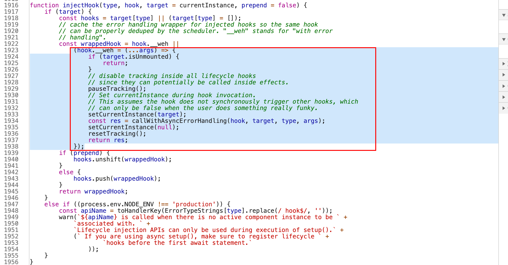
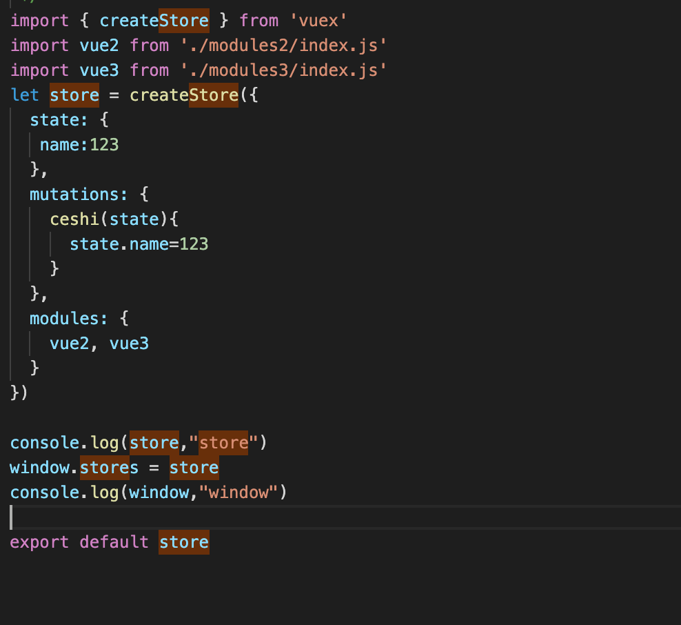

# 记录问题

## 2021/3/22 -  2021/3/26

###  mounted 执行时机 顺序 有多个时执行那个
>vue3:依次从上往下执行 vue2:只执行最后一个

### 混合使用data和setup时 优先执行那个
>谁写在最后执行谁

### mounted函数 有无返回值 返回的函数是什么意思？
>有返回值。

### 查 store 能否挂在window对象上
>可以 

### import { useRouter } from "vue-router"; 为啥这么写
> router 结构需要使用的方法

### 响应式数据改成对象会不会报错
>不会 
